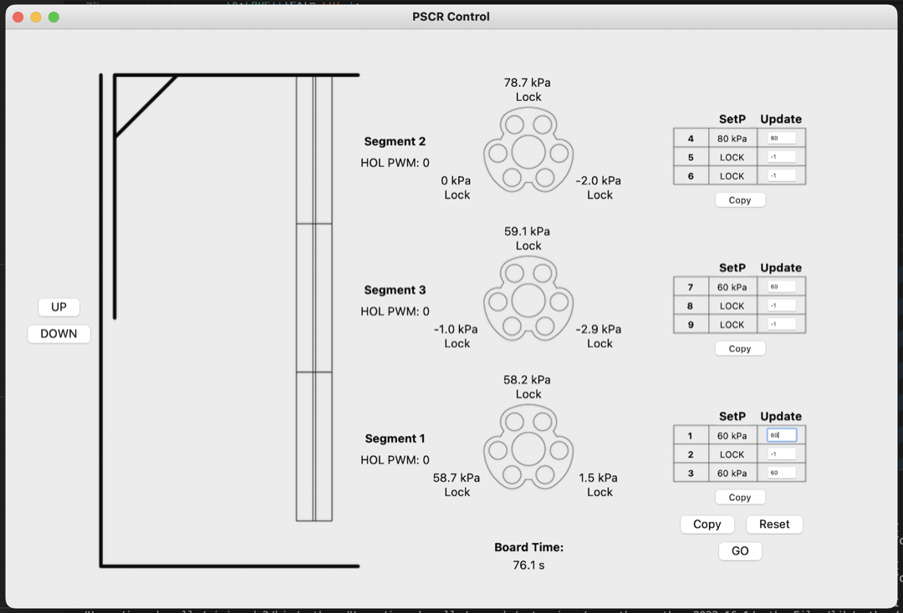

In order to interface with the robot over Serial, a simple user interface was built in Python:

It can be found [here](https://github.com/3-PSCR/GUI).

This project was designed and submitted as part of a Master's Project. Full documentation will be made available once marking has concluded.

