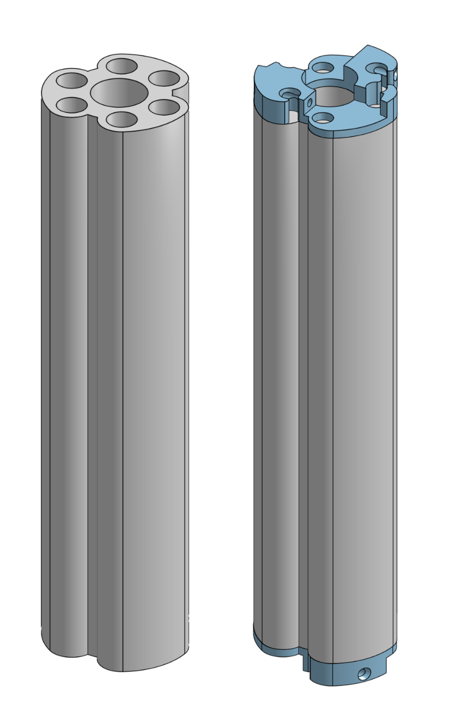
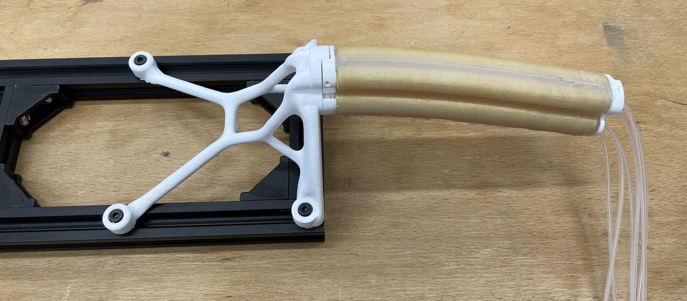
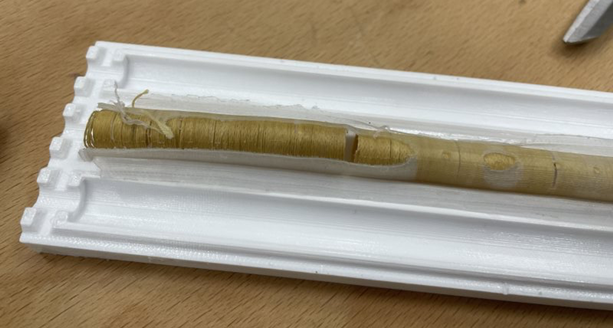
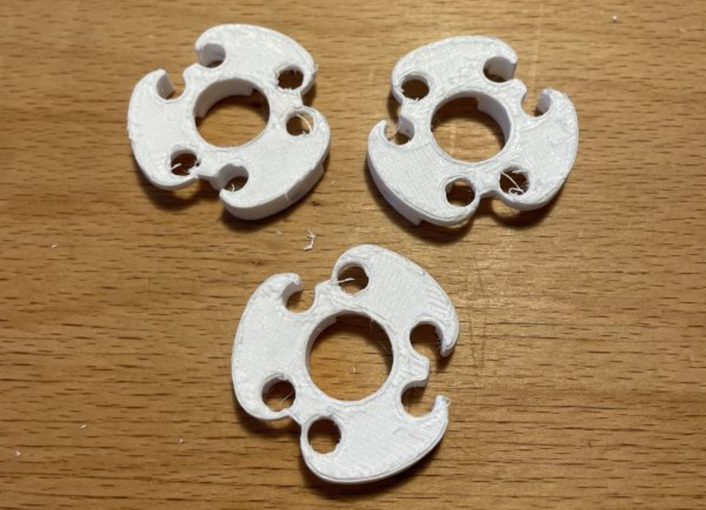

# Segment Manufacture

This page explains the manufacturing method for a six-chambered silicone soft robotic segment with Kevlar reinforcement. In the below, it is made of [Smooth-On© EcoFlex™ 00-50](https://www.smooth-on.com/products/ecoflex-00-30/), which gives it a maximum supported pressure of around 100 kPa, although from experimentation there is little extra bending above 80 kPa. An accompanying video is provided here to better explain the steps.

Please feel free to use this manufacturing process where helpful, citing this page.

# Segment Design

The 6-chambered segment without the silicone plugs to keep it airtight (showing the chambers, left) and with the plugs and 3D-printed end connectors designed for linking segments (right).

The segments are up to 140 mm long, with six internal chambers (each with a volume of 5.16 cm**³** at a segment length of 140 mm). Each chamber is connected to a thin silicone hose (not shown in CAD) to provide pressurised air: these hoses can be paired up to give 3 separate chambers which can bend the segment in any direction. 

Casting the chambers is a lengthy process involving at least five separate silicone pours, and this guide is meant to help anyone wishing to manufacture a similar segment not to have to spend the several months it took me to develop all the moulds and processes.

A segment, including end connectors and silicone tubes, mounted on a horizontal mount.

# Required Materials

The following was used to cast these segments:

### Equipment

- Silicone casting equipment:
    - Scales
    - Plastic cups to mix silicone in
    - Stirring sticks
    - De-gassing chamber
    - An oven or heat plate (if silicone is being fast-cured)
    - A syringe with a short length of silicone tube (not required but can be helpful)
- Permanent marker
- Scissors
- Sharp knife
- Masking tape / electrical tape
- Scraper / flathead screwdriver
- Plastic gloves
- Long-nose pliers
- (Optional) Battery drill
- (Optional) Heat gun

Note that, with the exception of the 7mmOD tubes (where it is optional but not required), mould release should not be used as it will interfere with the silicone bonding to itself.

### Purchase Requirements

- [Kevlar string](https://www.amazon.co.uk/dp/B08H25CZZS) (40 lb version). One spool should make around 5 segments.
- [9mm OD brass tubes](https://www.amazon.co.uk/gp/product/B0B5D232RD). At least 3, but 6 is best for convenience. At least 50mm longer than the segment being made.
- [7mm OD tubes](https://www.amazon.co.uk/gp/product/B09GF9V2FZ/). 6 are required. Again, at least 50mm longer than the segment.
- Silicone air hoses. [2mmOD food grade tubes](https://www.amazon.co.uk/gp/product/B0C5824VC6/) were used.
- Your chosen silicone. As above, [EcoFlex 50](https://www.smooth-on.com/products/ecoflex-00-30/) was used.
- Silicone glue.

### 3D Printed Components

PETG was used as it was found to be suitably robust. If silicone will not be cured ion an oven, PLA will likely work too though this has not been tested. Please take note of the configurations (top-left of the Onshape window) of the Part Studios, they *are* important.

**From the Actuator Cores Mould part studio, [here](https://cad.onshape.com/documents/fd21cb60026f1c393fb2e134/v/75fa9e217d92debf440e9fa3/e/84a4a0b73eda3f01f6936ff5):**

**In the Large Bore configuration with Tube Mounts on Clamp ticked:** (print half the number of Pins and Clamp Items if using only 3x 9mmOD tubes).

- 6x Pin
- 2x Clamp Item
- 2x Casing Top
- 2x Casing Bottom

**In the Small Bore configuration with Tube Mounts on Clamp ticked:**

- 6x Pin
- 2x Clamp Item

**In either configuration with Tube Mounts on Clamp un-ticked:**

- 2x Clamp Item

**From the Main Mould part studio, [here](https://cad.onshape.com/documents/fd21cb60026f1c393fb2e134/v/75fa9e217d92debf440e9fa3/e/62c24f13fdfc238956b9c5e5):**

- 3x Mould Wall
- 1x Base
- 1x Top Clamp
- 1x Round Clamp

**From the End Cap Mould part studio, [here](https://cad.onshape.com/documents/fd21cb60026f1c393fb2e134/v/75fa9e217d92debf440e9fa3/e/fe7bc889f81b8c10a949dc60):**

- 1x Cap Mould in Blank configuration
- 1x Cap Mould in Tubes configuration

# A. Chamber Reinforcement

The first step is to make and prepare the ‘cores,’ which will become the reinforcement within the segment. At this stage, the following is required:

- 9mmOD tubes
- Kevlar string
- 6x large Pin parts

1. Mark the length of the segment onto the outside of one of the 9mmOD tubes with the permanent marker (in this case 140mm).
2. Put the non-segment end (the end we did not measure from for step 1) into the drill chuck and tighten.
3. Place the end of the Kevlar filament over the end of the 9mmOD tube and secure it by pushing the Pin in, narrow end facing out.
4. Slowly rotate the tube with the drill, feeding Kevlar onto the tube in a continuous, smooth wrap
5. When the mark from (1) is reached, stop.
6. Cut the Kevlar filament and secure. A [clove hitch knot](https://www.netknots.com/rope_knots/clove-hitch) is usually suitable for this - it must release later.
7. Repeat Steps 1-6 until all 6 tubes have been wound. Care must be taken not to damage or unwind the completed tubes.

# B. Cast Core Outer Layer

Now we cast silicone over the wrapped tubes to encase them. In C we will cast the insides of the chambers - this has to be done in a separate step. The following is required:

- 2x Casing Top
- 2x Casing Bottom
- 2x Clamp Items with large bore
- 2x Clamp Items with Tube Mounts un-ticked

1. Mix and de-gas silicone (approximately 80 g)
2. Pour a layer of silicone into the grooves in both Casing Bottom parts
3. Carefully insert the cores prepared in A into the Casing Bottom parts. Use the Clamp Item to support the cores in the Casing Bottom
4. Pour more silicone over the kevlar windings so that all of the kevlar has a layer of silicone over it.
5. De-gas thoroughly
6. Top up silicone as necessary
7. Push Casing Top onto Casing Bottom and secure using the Clamp Item already on the cores, and one of the tubeless Clamp Items. The conical reservoirs at the top of the casings should be filled with silicone.
8. Leave to cure vertically. Degassing at this stage was found to force too much silicone out of the moulds. Optionally, a heat gun can be used to fast-cure the bottom of each mould so that the silicone cannot leak out as the rest cures.

Leaving the cores horizontal during curing was found to cause significant air gaps. If they are vertical, the reservoirs of extra silicone at the top do not allow these voids to develop.

# C. Cast Core Inner Layer

We now remove the 9mmOD tubes and replace them with 7mmOD tubes to cast the final inner wall of the segments. The following is required:

- The moulds from above, once the silicone has cured
- 6x 7mmOD tubes
- 6x small Pins
- 2x Clamp Items with small bore

1. Push the 6x small Pins partway into the ends of the 7mmOD tubes, with around 5mm left sticking out. Some superglue can be helpful to secure them in place, depending on the print tolerance of the 3D printer.
2. Remove the Clamp Items from the cured moulds from B.
3. Carefully prise the Casing Top apart from the Casing Bottom. Scrapers or flathead screwdrivers can be helpful. Care must be taken not to damage the silicone inside, or it will not bond to the rest of the segment later. Wearing plastic gloves is advisable.
4. Very carefully remove the cast tubes from the 3D printed moulds
5. Using a sharp knife, cut the silicone and the Kevlar at the two ends of the segments and remove excess. Cut ‘flashing’ off the sides of the castings using scissors or flush cutters.
6. Using a clean hand or glove, grab the outside of the moulded tube. Hold the free end of the brass tube with long nose pliers.
7. Slowly and carefully remove the moulded section from the outside of the brass tube. Twisting slowly in the same direction as the kevlar winding direction was found effective for this. Any damage to the silicone or the Kevlar wrap at this stage necessitates starting again.
8. Place the moulded cores back into the Casing Bottoms, put the Casing Tops back on, and secure with the tubeless Clamp Items. Stand them on end.
9. Mix and de-gas approximately 100 g of silicone.
10. Pour silicone into each of the moulded cores. A syringe was found to be helpful but not essential. Each core requires around 10 ml of silicone (at 140 mm length).
11. De-gas
12. Add the Clamp Items with small bores to the tops of the Casings
13. Very slowly and carefully push the 7mmOD brass tubes into the cores, pin-end facing down. The slower this is done the better.
14. Use any excess silicone to top up the cores. Again, a heat gun can optionally be used to cure the silicone leaking out at the bottom of the vertical moulds.

# D. Joining the cores - casting the main segment

Here we take the six cores and cast them together into the main segment. We use the following:

- 6x cores cast above
- 3x Mould Wall
- 1x Base
- 1x Top Clamp
- 1x Round Clamp

1. Carefully remove the cores cast above from the Casings. The brass tubes do not need to be removed at this stage.
2. Cut excess off the silicone as in 19.
3. Stand the Cores in the Base, inserting the Pins into the holes in the Base.
4. Build the 3 Mould Walls around the Cores as per the [OnShape assembly](https://cad.onshape.com/documents/fd21cb60026f1c393fb2e134/v/75fa9e217d92debf440e9fa3/e/379447301839b7b3585ebeaf): use the Round Clamp to hold the Mould Walls together, and the Top Clamp to hold the walls in place and keep the tubes from moving
5. It was found that silicone was prone to leaking between the mould walls. Wrapping with tape fixed the issue.
6. Mix and de-gas approximately 60 g of silicone
7. Slowly fill the gaps between the Cores with silicone. It was found to be helpful to do the chamber in two separate pours to achieve best filling. This process requires patience and an almost never-ending fill-degas-fill-degas cycle to get as much silicone into the gaps as possible. A syringe with a small flexible tube is also helpful but not essential.
8. Once the silicone has cured, remove the mould and carefully pull out the brass tubes as in 21. Any small gaps can now be filled carefully with a very small amount of silicone.

Insufficient care at steps 21. or 36. was found to result in significant damage to the cores. In this case, the damaged core can be cut out and replaced without starting the whole segment again.

# E. Capping the Chambers

The end caps can now be cast onto the segment. The following was used:

- The segment from D.
- 1x Cap Mould in Blank configuration
- 1x Cap Mould in Tubes configuration

1. This must be done in two pours, each requiring a very small amount of silicone (around 10 g), which should be mixed and de-gassed.
2. Fill the Cap Mould in Tubes configuration to the overflow cutouts around the edge. Overfilling resulted in too thick end-caps. It is important to start with the Tubes end otherwise the segment will end up sealed when trying to cast the other end.
3. Push one end of the segment down into the end cap mould until it is seated at the very bottom
4. Once silicone is cured, remove mould repeat 37-29 for the other end, using the other end cap
5. Again once silicone is cured, remove the mould. One end of the segment has 6x 2mm holes for the air hoses in the end caps
6. Put a small amount of silicone glue onto the outside of the ends of 6 pieces of the air hose and push them into the hole. Twisting them in was found to be easier and ensured better glue coverage, reducing the chances of leaks.
7. The segment is now complete!

In the application for which these segments were developed, they were attached end-to-end, and therefore a connector was developed. It can be found [here](https://cad.onshape.com/documents/d4800f88e3e7bb9c83217014/v/e4b09e6e306befbb1308731c/e/b5fb20dc208ad6354273c27d), and glued on with silicone glue. It was found that printing these parts on a raft made their lower surfaces sufficiently rough for the silicone glue to adhere well.

The cap components with rough surfaces - two of these mate together to join two segments. They are common parts so both ends of the segments are compatible.